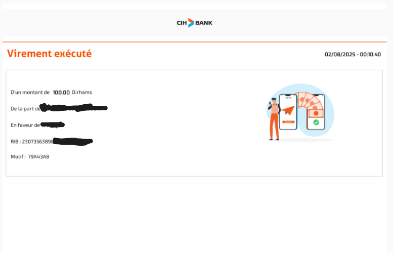

# 🧾 Bank Statement OCR Summarizer

A simple C++ command-line tool that recursively scans a folder of bank statement images, extracts all numbers with decimal points using OCR (Optical Character Recognition), and calculates the total sum.

This is useful for quickly totaling transactions from printed or scanned bank receipts and statements.

---

## ✨ Features

- Recursively processes folders of images
- Uses Tesseract OCR to extract text
- Automatically detects and sums all values with decimals (e.g., `29.95`)
- Supports image formats: `.jpg`, `.jpeg`, `.png`, `.bmp`, `.tif`
- Written in C++17 with OpenCV and Tesseract

---


## 🖼️ Example Input

**Example Bank Receipt Image:**



*Replace `example_receipt.jpg` with your ow_*

---

## 🧰 Dependencies

- [Tesseract OCR](https://github.com/tesseract-ocr/tesseract)
- [OpenCV](https://opencv.org/)
- C++17 compiler (e.g., `g++`)

Install on Ubuntu:

```bash
sudo apt install libtesseract-dev libopencv-dev tesseract-ocr tesseract-ocr-eng
```

---


## ▶️ Running the Program

Build the project using `make`, then run the exectubale followed by the path to a folder with all the receipt pictures.

```bash
./ocr_sum /path/to/folder/with/receipts
```

ps: u can manually paste the flags in flags.txt into the makefile for better performance.
